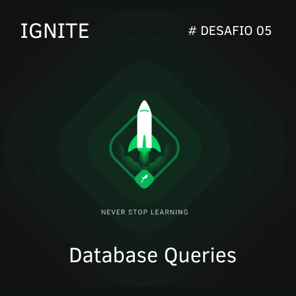

<h1 align="center">
  
</h1>

<h1 align= "center">Desafio 05 - Database Queries </h1>

Desafio do treinamento Ignite de NodeJS, neste desafio eu apliquei os conceitos de SQL queries e também como se trabalha com  TYPEORM.

 <a href="#objetivo">Objetivo</a> •
 <a href="#tecnologias">Tecnologias</a> • 
 <a href="#autor">Autor</a>

## Features

- [x] Cadastro de usuário
- [x] Cadastro de games
- [X] Listagens de usuários
- [X] Contagens de usuários
- [X] "Compra" de games

## Objetivo

Aplicar o conhecimento que foi mostrado no desenvolvimento do app principal, conhecimentos sobre Queries SQl e Query Buider do TypeORM e também consultas SQL com o TypeORM.

### 🛠 Tecnologias
 As seguintes ferramentas foram usadas na construção do projeto:
 - [Node.js](https://nodejs.org/en/)
 - [TypeScript](https://www.typescriptlang.org/)
 - [Docker](https://www.docker.com/)
 - [TypeORM](https://typeorm.io/#/)
 

<h4 align="center"> 
	✅  Database Queries 🚀 Finalizado...  ✅
</h4>

### Autor

 
  
 <b>João Dias</b> 🚀

Feito com ❤️ por João Dias 👋🏽 Entre em contato!

 

### License
[MIT](https://choosealicense.com/licenses/mit/)
